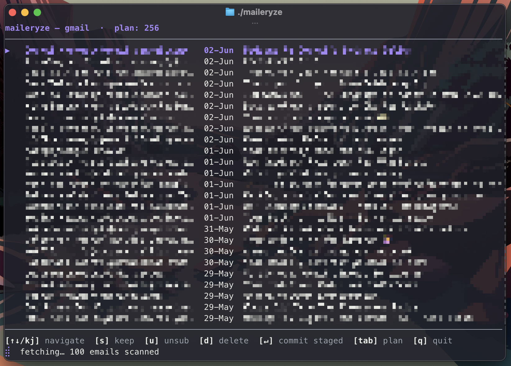
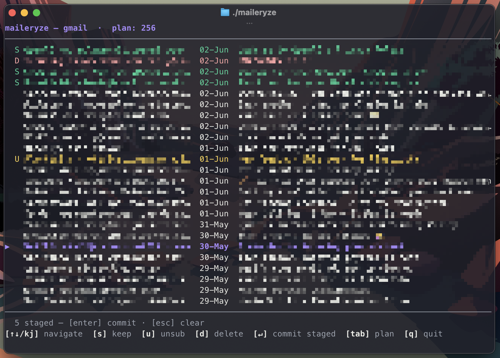
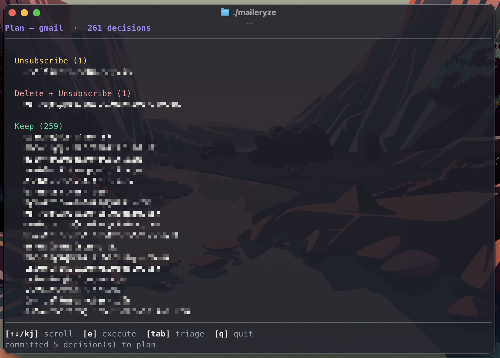

# How to use maileryze

## Prerequisites

See the [README](README.md) for installation instructions. You will need:

* A config file in `~/.config/maileryze/maileryze.toml`
* A `credentials.json` file in `~/.config/maileryze/credentials.json`
* The `maileryze` executable in your PATH

## Running

The flow of the application is as follows:

1. Triage senders by seeing all your latest emails.
2. Mark emails as saved, unsubscribed, or deleted, which adds the senders to those respective lists.
3. Review the lists of saved, unsubscribed, and deleted senders.
4. Execute actions on the lists, such as unsubscribing or deleting senders.
5. Repeat.

---

### Triage

Start the application by running `maileryze` in your terminal.

Depending on you internet speed, you should start seeing your latest emails appear in the interface.

Review actions by marking emails.

* `s` - Save the sender
* `u` - Try to unsubscribe from the sender
* `d` - Delete all and try to unsubscribe

Then press `Enter` to commit those changes to the plan.

_Senders that are already on the plan should disappear from the triage view when you commit._

### Review

Press `Tab` to change between the triage view and the plan view.

### Execute

If you're happy with the plan, press `e` to execute it. This will send the unsubscribe requests and delete the senders from your lists.

### Undoing changes

If you accidentally commit something to the plan, you can manually modify it editing the plan file directly: `~/.config/maileryze/{alias}_plan.toml`

The file has keys of:

* `keep` - senders to save
* `unsubscribe` - senders to unsubscribe
* `delete` - senders to delete
* `handled` - senders that have already been handled
